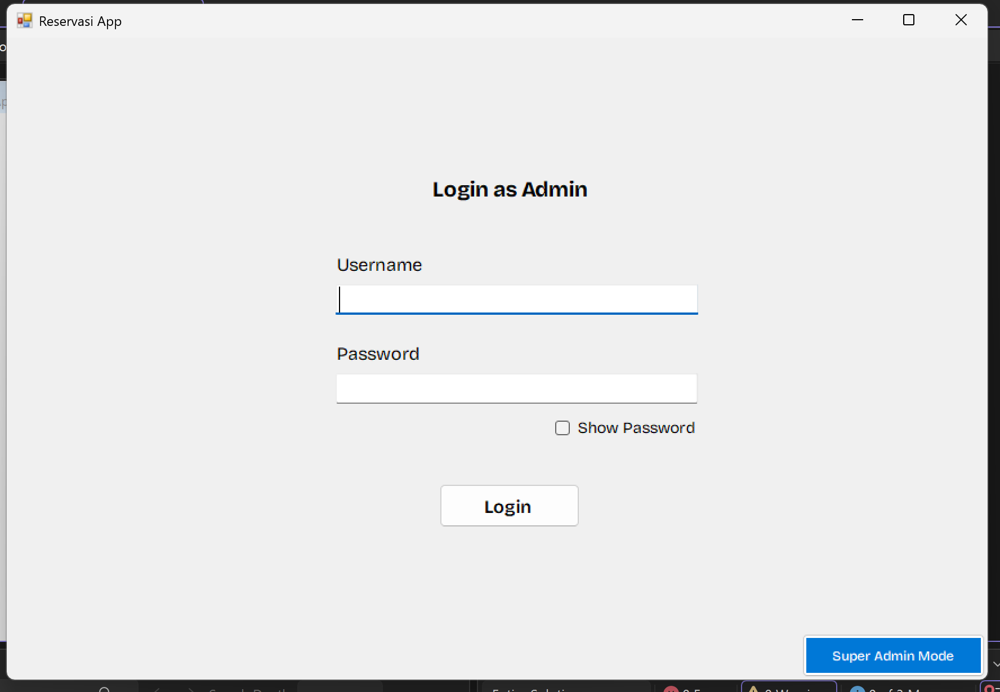
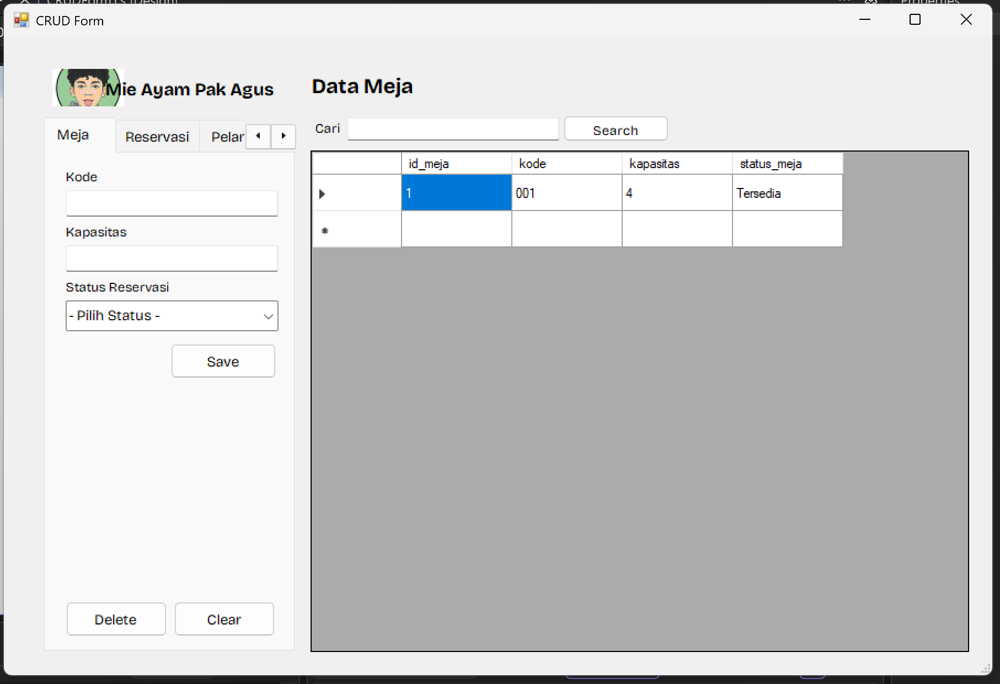
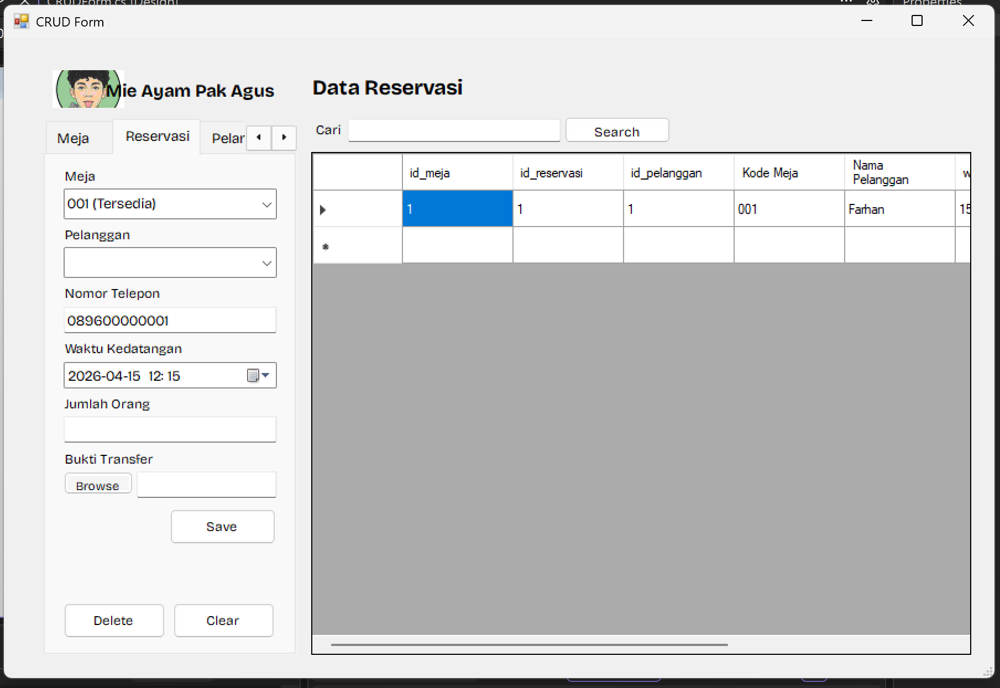
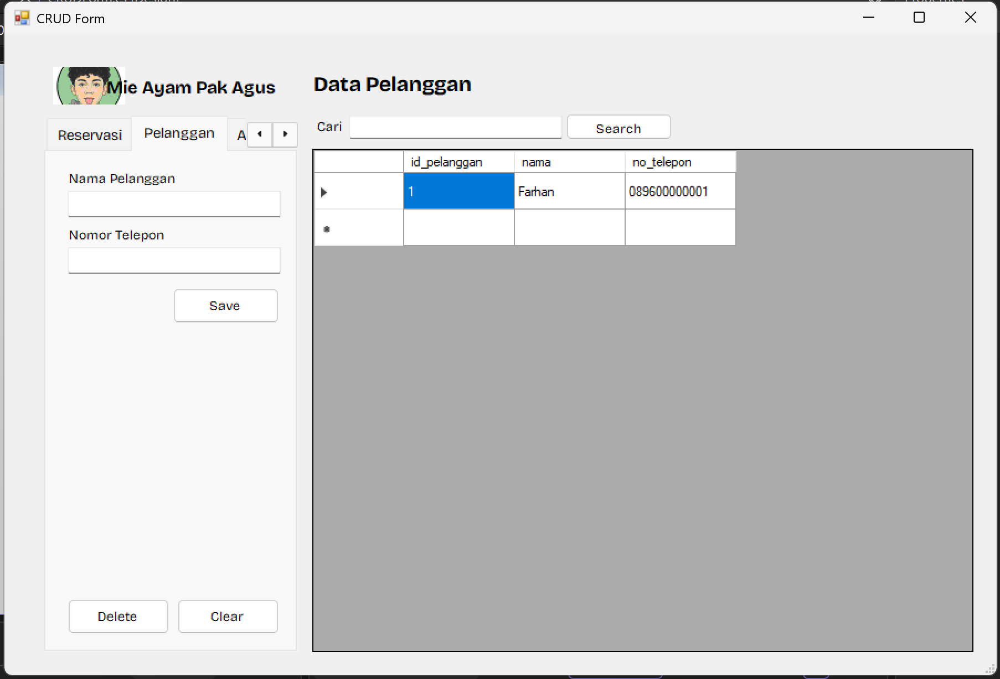
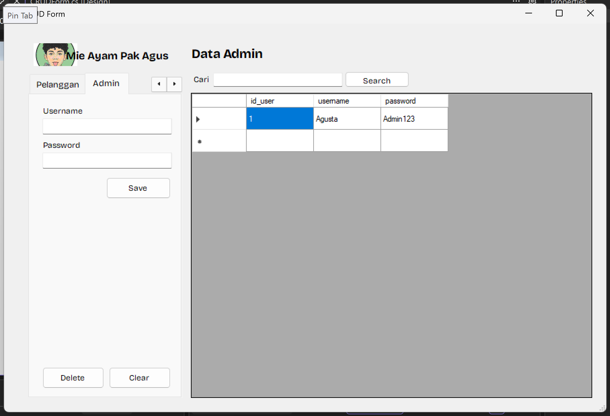

# 🍜 Mie Ayam Pak Agus — Sistem Manajemen Reservasi

> Aplikasi desktop berbasis **Windows Forms (.NET)** untuk mengelola reservasi meja, data pelanggan, dan manajemen admin pada warung Mie Ayam Pak Agus.

---

## 📸 Screenshots

### Halaman Login

> *Tampilan form login dengan opsi Super Admin Mode*

### Dashboard Utama — Tab Meja

> *Manajemen data meja: kode, kapasitas, dan status meja*

### Dashboard Utama — Tab Reservasi

> *Form reservasi dengan auto-fill data pelanggan dan validasi status meja*

### Dashboard Utama — Tab Pelanggan

> *Manajemen data pelanggan dan nomor telepon*

### Dashboard Utama — Tab Admin *(Super Admin Only)*

> *Manajemen akun admin, hanya terlihat di Super Admin Mode*

---

## 📋 Daftar Isi

- [Tentang Proyek](#-tentang-proyek)
- [Fitur Utama](#-fitur-utama)
- [Teknologi yang Digunakan](#-teknologi-yang-digunakan)
- [Prasyarat](#-prasyarat)
- [Instalasi & Setup](#-instalasi--setup)
- [Konfigurasi Database](#-konfigurasi-database)
- [Cara Penggunaan](#-cara-penggunaan)
- [Struktur Proyek](#-struktur-proyek)
- [Skema Database](#-skema-database)
- [Akun Default](#-akun-default)
- [Kontribusi](#-kontribusi)
- [Lisensi](#-lisensi)

---

## 🧾 Tentang Proyek

**Mie Ayam Pak Agus** adalah sistem manajemen reservasi meja berbasis desktop yang dirancang untuk memudahkan operasional warung makan. Aplikasi ini memungkinkan staf admin untuk mengelola meja, melakukan pencatatan reservasi pelanggan, serta mengelola akun pengguna sistem — semua dalam satu antarmuka yang terintegrasi.

Aplikasi dibangun menggunakan **C# Windows Forms** dengan koneksi langsung ke **Microsoft SQL Server**, menjadikannya solusi yang ringan, cepat, dan mudah dioperasikan tanpa memerlukan koneksi internet.

---

## ✨ Fitur Utama

### 🔐 Autentikasi & Otorisasi
- **Login Admin** — Verifikasi username & password dari database
- **Super Admin Mode** — Akses khusus menggunakan PIN (`123456`) yang membuka tab Admin tersembunyi
- **Show/Hide Password** — Checkbox untuk menampilkan atau menyembunyikan password saat login

### 🪑 Manajemen Meja
- **Tambah meja** baru dengan kode unik, kapasitas, dan status
- **Edit** data meja yang sudah ada (klik baris di tabel)
- **Hapus** meja dengan konfirmasi dialog
- **Status meja** tersedia dalam tiga kondisi: `Tersedia`, `Terisi`, `Dipesan`
- **Pencarian** meja berdasarkan kode atau status

### 👤 Manajemen Pelanggan
- **Tambah, edit, hapus** data pelanggan (nama & nomor telepon)
- **Pencarian** pelanggan berdasarkan nama atau nomor telepon
- **Auto-create pelanggan** saat membuat reservasi — jika nomor telepon belum terdaftar, pelanggan baru otomatis dibuat

### 📅 Manajemen Reservasi
- **Buat reservasi** dengan memilih meja, pelanggan, waktu kedatangan, dan jumlah orang
- **Auto-fill telepon** saat memilih pelanggan dari dropdown
- **Peringatan status meja** — notifikasi otomatis jika meja yang dipilih sedang `Terisi` atau `Dipesan`
- **Upload bukti transaksi** (path file lokal) menggunakan file dialog
- **Edit & hapus** reservasi yang sudah ada
- **Pencarian** reservasi berdasarkan nama pelanggan atau kode meja

### 👨‍💼 Manajemen Admin *(Super Admin Only)*
- **Tambah, edit, hapus** akun admin
- Tab ini **tersembunyi** dari admin biasa dan hanya muncul di Super Admin Mode

### 🔍 Fitur Umum
- **Pencarian real-time** yang kontekstual — berbeda di setiap tab
- **Shared DataGridView** — satu tabel yang ditampilkan di semua tab secara dinamis
- **Form auto-clear** saat berpindah tab atau menekan tombol Clear

---

## 🛠 Teknologi yang Digunakan

| Komponen | Detail |
|---|---|
| **Bahasa** | C# |
| **Framework** | .NET Framework 4.7.2 |
| **UI Framework** | Windows Forms (WinForms) |
| **Database** | Microsoft SQL Server (SQL Express) |
| **Data Access** | `System.Data.SqlClient` |
| **IDE** | Visual Studio 2022 / 2019 |
| **Project Type** | WinExe (Desktop Application) |

---

## ✅ Prasyarat

Pastikan perangkat Anda telah memiliki:

- **Windows 10/11** (64-bit direkomendasikan)
- **Visual Studio 2019 atau 2022** dengan workload `.NET desktop development`
- **Microsoft SQL Server Express** (atau SQL Server versi lainnya)
- **.NET Framework 4.7.2** (biasanya sudah terinstall di Windows 10+)

---

## 🚀 Instalasi & Setup

### 1. Clone Repository

```bash
git clone https://github.com/username/MieAyamPakAgus.git
cd MieAyamPakAgus
```

### 2. Setup Database

Buka **SQL Server Management Studio (SSMS)** atau **Azure Data Studio**, lalu jalankan script SQL berikut:

```bash
# Lokasi file SQL:
Database/MieAyamPakAgus.sql
```

Atau salin dan jalankan isi file tersebut langsung di query editor SSMS. Script ini akan:
- Membuat database `MieAyamPakAgus`
- Membuat semua tabel yang diperlukan (`Admin`, `Pelanggan`, `Meja`, `Reservasi`)
- Memasukkan data admin default

### 3. Konfigurasi Connection String

Buka file `MieAyamPakAgus/DBConfig.cs` dan sesuaikan connection string:

```csharp
// Default (SQL Express dengan Windows Authentication)
public static string ConnectionString = @"Data Source=.\SQLEXPRESS;Initial Catalog=MieAyamPakAgus;Integrated Security=True";

// Jika menggunakan SQL Server penuh
public static string ConnectionString = @"Data Source=localhost;Initial Catalog=MieAyamPakAgus;Integrated Security=True";

// Jika menggunakan SQL Authentication
public static string ConnectionString = @"Data Source=.\SQLEXPRESS;Initial Catalog=MieAyamPakAgus;User ID=sa;Password=yourpassword";
```

### 4. Build & Jalankan

1. Buka **`MieAyamPakAgus.slnx`** di Visual Studio
2. Tekan `Ctrl+Shift+B` untuk Build
3. Tekan `F5` untuk menjalankan aplikasi
4. Atau klik **Debug → Start Debugging**

---

## 🗄 Konfigurasi Database

File konfigurasi koneksi database berada di:

```
MieAyamPakAgus/DBConfig.cs
```

Kelas `DBConfig` adalah kelas statis yang menyediakan tiga method utama:

| Method | Kegunaan |
|---|---|
| `ExecuteQuery(query, params)` | Mengembalikan `DataTable` — untuk SELECT |
| `ExecuteNonQuery(query, params)` | Mengembalikan jumlah baris terpengaruh — untuk INSERT, UPDATE, DELETE |
| `ExecuteScalar(query, params)` | Mengembalikan satu nilai — untuk agregat atau ID terakhir |

Semua method menggunakan **parameterized query** untuk mencegah SQL Injection.

---

## 📖 Cara Penggunaan

### Login sebagai Admin Biasa
1. Jalankan aplikasi
2. Masukkan **Username** dan **Password**
3. Klik tombol **Login**
4. Tab `Admin` tidak akan terlihat di mode ini

### Login sebagai Super Admin
1. Jalankan aplikasi
2. Klik tombol **Super Admin** (atau sejenisnya di form login)
3. Masukkan PIN: **`123456`**
4. Anda akan memiliki akses penuh termasuk tab **Admin**

### Membuat Reservasi Baru
1. Buka tab **Reservasi**
2. Pilih **Meja** dari dropdown (peringatan otomatis jika meja tidak tersedia)
3. Pilih **Pelanggan** dari dropdown, atau ketik nama baru
4. Isi nomor telepon (auto-fill jika pelanggan dipilih dari daftar)
5. Atur **Waktu Kedatangan** menggunakan DateTimePicker
6. Isi **Jumlah Orang**
7. *(Opsional)* Lampirkan **Bukti Transaksi** via tombol file dialog
8. Klik **Save** — jika pelanggan baru, akan otomatis ditambahkan ke database

### Edit / Hapus Data
1. Klik baris pada tabel — form otomatis terisi dengan data tersebut
2. Ubah data yang diinginkan, lalu klik **Save** untuk update
3. Atau klik **Delete** dan konfirmasi untuk menghapus
4. Klik **Clear** untuk mereset form dan membatalkan operasi edit

---

## 📁 Struktur Proyek

```
MieAyamPakAgus/
│
├── 📁 Database/
│   └── MieAyamPakAgus.sql          # Script SQL untuk membuat database & tabel
│
├── 📁 MieAyamPakAgus/              # Source code utama (C# project)
│   ├── Program.cs                  # Entry point aplikasi
│   ├── DBConfig.cs                 # Kelas helper koneksi & eksekusi database
│   │
│   ├── Login.cs                    # Form Login (logika autentikasi)
│   ├── Login.Designer.cs           # Auto-generated UI code untuk Login
│   ├── Login.resx                  # Resource file untuk Login
│   │
│   ├── CRUDForm.cs                 # Form utama (logika CRUD semua modul)
│   ├── CRUDForm.Designer.cs        # Auto-generated UI code untuk CRUDForm
│   ├── CRUDForm.resx               # Resource file untuk CRUDForm
│   │
│   ├── App.config                  # Konfigurasi aplikasi
│   ├── MieAyamPakAgus.csproj       # File project C#
│   │
│   └── 📁 Properties/
│       ├── AssemblyInfo.cs
│       ├── Resources.resx
│       └── Settings.settings
│
├── MieAyamPakAgus.slnx             # Solution file Visual Studio
├── .gitignore
├── .gitattributes
├── LICENSE.txt
└── README.md
```

---

## 🗃 Skema Database

### Tabel `Admin`
| Kolom | Tipe | Keterangan |
|---|---|---|
| `id_user` | INT (PK, Identity) | Primary Key, auto-increment |
| `username` | VARCHAR(100) UNIQUE | Username login, harus unik |
| `password` | VARCHAR(100) | Password login |

### Tabel `Pelanggan`
| Kolom | Tipe | Keterangan |
|---|---|---|
| `id_pelanggan` | INT (PK, Identity) | Primary Key, auto-increment |
| `nama` | VARCHAR(100) | Nama lengkap pelanggan |
| `no_telepon` | VARCHAR(100) | Nomor telepon pelanggan |

### Tabel `Meja`
| Kolom | Tipe | Keterangan |
|---|---|---|
| `id_meja` | INT (PK, Identity) | Primary Key, auto-increment |
| `kode` | VARCHAR(5) UNIQUE | Kode meja, contoh: `A1`, `B2` |
| `kapasitas` | INT | Jumlah kursi tersedia |
| `status_meja` | VARCHAR(20) DEFAULT `'Tersedia'` | `Tersedia` / `Terisi` / `Dipesan` |

### Tabel `Reservasi`
| Kolom | Tipe | Keterangan |
|---|---|---|
| `id_reservasi` | INT (PK, Identity) | Primary Key, auto-increment |
| `id_pelanggan` | INT (FK) | Referensi ke `Pelanggan.id_pelanggan` |
| `id_meja` | INT (FK) | Referensi ke `Meja.id_meja` |
| `id_user` | INT (FK) | Referensi ke `Admin.id_user` (yang membuat reservasi) |
| `waktu_kedatangan` | DATETIME | Waktu rencana kedatangan pelanggan |
| `jumlah_orang` | INT | Jumlah orang yang akan datang |
| `bukti_transaksi` | VARCHAR(255) NULL | Path file bukti pembayaran (opsional) |
| `created_at` | DATETIME DEFAULT `GETDATE()` | Waktu reservasi dibuat |

> **Constraint:** Kombinasi `(id_meja, waktu_kedatangan)` harus unik — satu meja tidak bisa dipesan dua kali di waktu yang sama.

### Diagram Relasi (ERD)

```
Admin ──────────────────────────────────────────╮
  │ id_user (PK)                                 │
  │ username                                     │
  │ password                                     │
                                                 │
Pelanggan ──────────────────────────────────╮   │
  │ id_pelanggan (PK)                        │   │
  │ nama                                     │   │
  │ no_telepon                               │   │
                                             │   │
Meja ────────────────────────────────────╮  │   │
  │ id_meja (PK)                          │  │   │
  │ kode                                  │  │   │
  │ kapasitas                             │  │   │
  │ status_meja                           │  │   │
                                          │  │   │
Reservasi ──────────────────────────────────────╯
  │ id_reservasi (PK)                       │  │
  │ id_meja (FK) ───────────────────────────╯  │
  │ id_pelanggan (FK) ─────────────────────────╯
  │ id_user (FK)
  │ waktu_kedatangan
  │ jumlah_orang
  │ bukti_transaksi
  │ created_at
```

---

## 🔑 Akun Default

Setelah menjalankan script SQL, akun berikut tersedia secara otomatis:

| Role | Username | Password | Akses |
|---|---|---|---|
| **Admin** | `Agus` | `Admin123` | Semua tab kecuali Admin |
| **Super Admin** | *(PIN)* | `123456` | Semua tab termasuk Admin |

> ⚠️ **Penting:** Ubah PIN Super Admin dan password default sebelum digunakan di lingkungan produksi!

---

## 🏗 Arsitektur Aplikasi

```
┌─────────────────────────────────────────────┐
│              Presentation Layer              │
│  ┌─────────────┐    ┌───────────────────┐   │
│  │  Login.cs   │    │   CRUDForm.cs     │   │
│  │             │───▶│  ┌─────────────┐  │   │
│  │ - Auth      │    │  │  Tab Meja   │  │   │
│  │ - Super PIN │    │  │  Tab Rsvsi  │  │   │
│  └─────────────┘    │  │  Tab Plgn   │  │   │
│                     │  │  Tab Admin  │  │   │
│                     │  └─────────────┘  │   │
│                     └───────────────────┘   │
└─────────────────────────────────────────────┘
                        │
                        ▼
┌─────────────────────────────────────────────┐
│              Data Access Layer              │
│               DBConfig.cs                  │
│  - ExecuteQuery()                           │
│  - ExecuteNonQuery()                        │
│  - ExecuteScalar()                          │
└─────────────────────────────────────────────┘
                        │
                        ▼
┌─────────────────────────────────────────────┐
│              Database Layer                 │
│         Microsoft SQL Server Express        │
│  ┌──────────┐  ┌──────────┐  ┌──────────┐  │
│  │  Admin   │  │   Meja   │  │ Pelanggan│  │
│  └──────────┘  └──────────┘  └──────────┘  │
│              ┌──────────────┐               │
│              │   Reservasi  │               │
│              └──────────────┘               │
└─────────────────────────────────────────────┘
```

---

## 🤝 Kontribusi

Kontribusi sangat disambut! Berikut cara berkontribusi:

1. **Fork** repository ini
2. Buat branch fitur baru: `git checkout -b feature/nama-fitur`
3. Commit perubahan: `git commit -m 'feat: tambah fitur X'`
4. Push ke branch: `git push origin feature/nama-fitur`
5. Buat **Pull Request**

### Panduan Commit Message

| Prefix | Kegunaan |
|---|---|
| `feat:` | Menambahkan fitur baru |
| `fix:` | Memperbaiki bug |
| `docs:` | Perubahan dokumentasi |
| `refactor:` | Refactoring kode |
| `style:` | Perubahan format/style |

---

## 📄 Lisensi

Proyek ini dilisensikan di bawah lisensi yang tercantum dalam file [LICENSE.txt](LICENSE.txt).

---

## 👤 Tentang

Dibuat sebagai sistem manajemen reservasi sederhana untuk warung **Mie Ayam Pak Agus** 🍜

---

*Dibangun dengan ❤️ menggunakan C# Windows Forms & SQL Server*